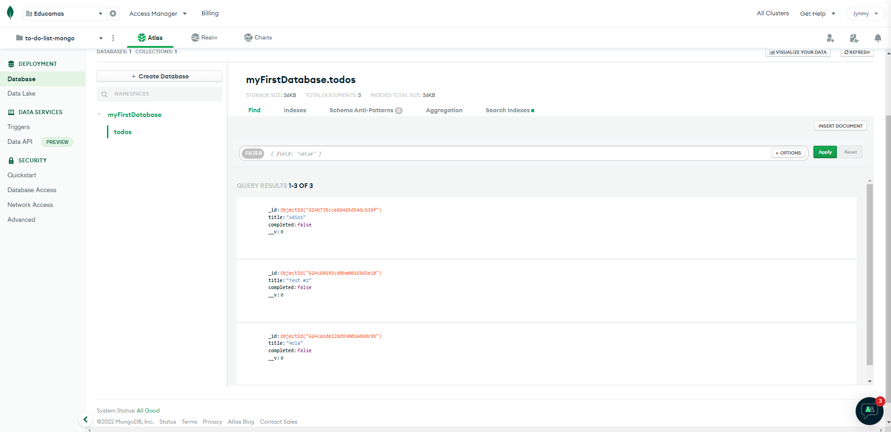

# TO-DO-LIST_MongoDB-backend-REMOTO

<!--- https://to-do-mongodb-backend.herokuapp.com/todos-->
- https://to-do-list-mongo-db-backend-9cf9k0g1r-jymmymurillo.vercel.app/todos

# TO-DO-LIST_MongoDB-frontend-REMOTO
- https://to-do-list-mongo-db-frontend-remoto.vercel.app

Backend creado con express.js y mongoose, conectado a una base de datos en Mongo Atlas.

 
  

